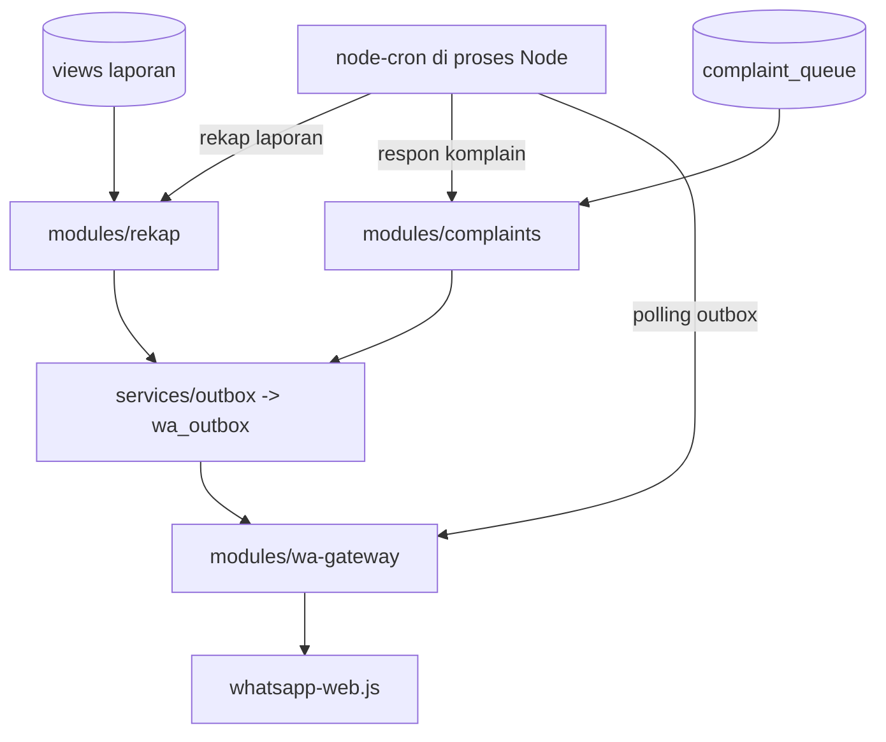

# Arsitektur Cron & WA Gateway

Dokumen ini menjelaskan kerangka sistem untuk refactor backend Cicero_V2.

## Alur Utama

1. **Cron job** mengeksekusi rekap sesuai jadwal.
2. **Module rekap** mengambil data dari view laporan.
3. **Outbox service** menyimpan pesan ke `wa_outbox`.
4. **WA gateway** mengambil pesan pending dan mengirim ke client WA berbasis `whatsapp-web.js`.
5. **Module komplain** mengambil komplain pending dan menyusun balasan standar.

### Diagram Alur Eksekusi Cron + Gateway



## Modul & Tanggung Jawab

| Modul | Tanggung Jawab |
| --- | --- |
| `cron/index.js` | Menjadwalkan rekap harian, mingguan, bulanan, task delivery recap, respon komplain, serta polling WA gateway. |
| `modules/rekap` | Query view laporan dan enqueue ke outbox. |
| `modules/complaints` | Query komplain pending dan update status setelah balasan. |
| `modules/wa-gateway` | Mengirim pesan WA yang telah masuk outbox. |
| `services/outbox.js` | Menulis pesan ke `wa_outbox`. |
| `services/wa-client.js` | Client WhatsApp Web berbasis `whatsapp-web.js` dengan LocalAuth. |

## Jadwal Cron (Default)

- **Daily report**: 07:00 setiap hari
- **Weekly report**: 07:00 setiap Senin
- **Monthly report**: 07:00 setiap tanggal 1
- **Task delivery recap**: setiap 30 menit
- **Complaint response**: setiap 5 menit
- **WA gateway polling**: setiap 2 menit (default)

## Konfigurasi Cron WA Gateway

Gunakan `WA_GATEWAY_POLL_CRON` untuk mengubah jadwal polling outbox WA tanpa perubahan kode. Nilai harus mengikuti format cron `node-cron`. Default: `*/2 * * * *`.

## Skema Database (Ringkas)

Dependensi schema Cicero_V2 yang harus tersedia:

- **Tabel**: `wa_outbox`, `complaint_queue`
- **View**: `task_delivery_recap_view`, `daily_report_view`, `weekly_report_view`, `monthly_report_view`

```sql
-- Outbox untuk WA
CREATE TABLE wa_outbox (
  id SERIAL PRIMARY KEY,
  recipient TEXT NOT NULL,
  content TEXT NOT NULL,
  type TEXT NOT NULL,
  status TEXT DEFAULT 'pending',
  created_at TIMESTAMP DEFAULT NOW(),
  sent_at TIMESTAMP
);

-- Queue komplain
CREATE TABLE complaint_queue (
  id SERIAL PRIMARY KEY,
  complainant TEXT NOT NULL,
  response_template TEXT NOT NULL,
  status TEXT DEFAULT 'pending',
  created_at TIMESTAMP DEFAULT NOW(),
  responded_at TIMESTAMP
);
```

## Mekanisme Cicero_V2 (Paralel)

- **Satu sumber data**: view laporan & queue komplain.
- **Mekanisme serupa**: data masuk ke outbox → gateway WA mengirimkan pesan.

## Catatan Cron (Proses Node)

Job cron dijalankan di dalam proses Node aplikasi ini (menggunakan `node-cron`), bukan cron OS. Jika ingin menjalankan via cron OS, jalankan script Node yang memanggil modul rekap/komplain sesuai jadwal di crontab terpisah dan pastikan aplikasi utama tidak menjalankan scheduler duplikat.

## Pairing & Session WhatsApp

- **Pairing QR**: QR code akan muncul di log pertama kali client dijalankan. Scan dengan WhatsApp untuk menghubungkan perangkat.
- **Session storage**: session tersimpan di disk (`WA_AUTH_PATH`) dengan nama `WA_SESSION_NAME` agar tidak perlu scan ulang.
- **Runtime dependency**: `whatsapp-web.js` memerlukan Chromium/Puppeteer. Pastikan dependency sistem Chromium terpasang atau gunakan `WA_PUPPETEER_ARGS` untuk argumen tambahan.
